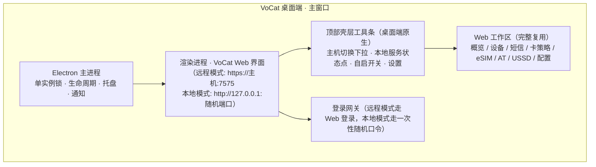
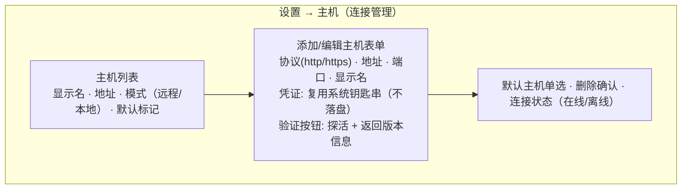
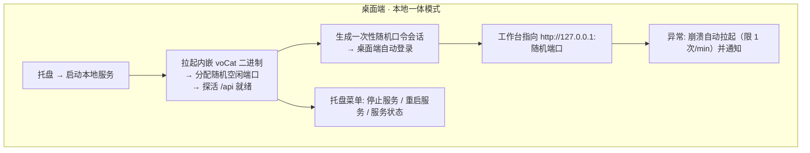
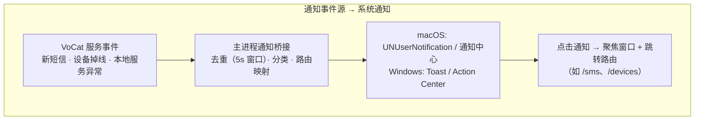
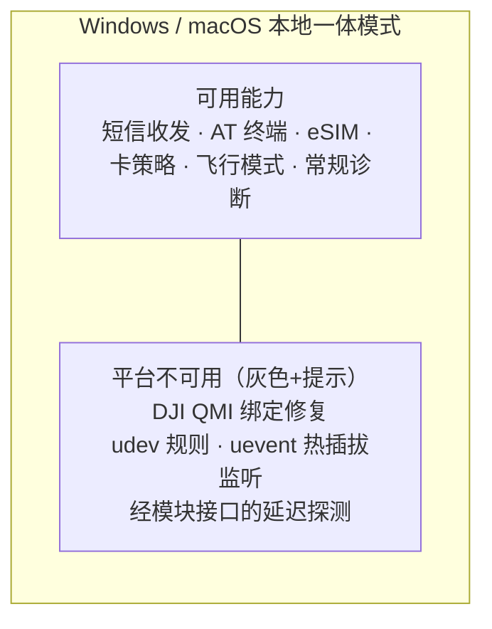
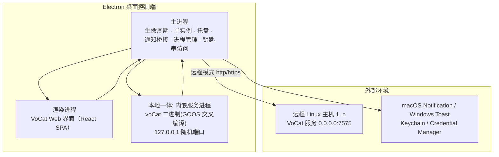

# VoCat 桌面控制端（macOS / Windows）PRD

创建日期：2026-09-03
适用版本：VoCat（MengMengCode/VoCat 分支）
目标平台：macOS（Apple Silicon + Intel）、Windows 10/11 x64

---

## 1. 需求背景

VoCat 目前以"浏览器访问 Web 管理台"的方式使用：服务二进制跑在模块接入的 Linux 主机（路由器、NAS、树莓派）上，用户用自己电脑的浏览器打开 `http://<主机>:7575` 完成设备接管、短信收发、网络诊断与固件调试。功能上没有缺失，缺的是"入口体验"。

社区实测和同类工具（DJOneHub、VoHive）都暴露了同一类诉求：控制端应常驻桌面而非开个浏览器标签页。理由可以归纳为三点：

1. **管理动作与日常使用割裂**——短信到达、模块掉线、卡策略切换这类需要即时感知的事件，浏览器标签页要么关着、要么在后台，用户往往在通知平台（Telegram/飞书）收到转发后才想起打开 VoCat。
2. **缺少系统级常驻体验**——没有托盘图标、没有开机自启、没有统一的"多台主机"入口；管理一台路由器上的模块要记 IP，管理多台要开多个标签页。
3. **本地直连场景无窗口**——社区用户偶尔会想在自己的 Windows/mac 电脑上直接插大疆 4G 模块调试（SMS、AT、eSIM 读写），此时仍要手动起服务再开浏览器，流程笨重。

结论是本轮要把"浏览器标签页"升级为"macOS + Windows 双平台原生桌面控制端"，让常驻、通知、多主机、本地直连都收敛到一个桌面应用里。`[Expert judgment]`

## 2. 目标与验收标准

目标：提供一个 macOS / Windows 的原生桌面控制端，覆盖远程管理与本地一体两种运行形态，完整复用现有 Web 功能，并把托盘、系统通知、开机自启、多主机连接收进桌面体验。

| 编号 | 验收标准 | 衡量方式 |
| --- | --- | --- |
| AC1 | macOS（Intel + Apple Silicon）与 Windows 10/11 均能一键安装并启动，安装包签名/公证状态满足平台常规分发要求 | 在两平台真机安装，记录安装步骤与包体积 |
| AC2 | 桌面端可配置任意数量的远程主机（协议 + 地址 + 端口 + 凭证），一键切换；凭证加密存储于系统钥匙串 | 录入 2 台主机并切换 10 次，凭证不丢失、明文中不出现 |
| AC3 | 本地一体模式下，插入模块即可接管：桌面端自动拉起内嵌服务、自动打开工作台，SMS/AT/eSIM 可用 | 在 Windows 与 macOS 分别插入大疆 4G 模块实测 |
| AC4 | 新短信到达或模块掉线时弹出系统通知；应用完全退出后不再收到通知 | 用测试短信触发，观察通知出现与退出后的消失 |
| AC5 | 桌面端内嵌界面功能与 Web 版一致（设备页、短信页、卡策略、AT 终端、健康卡片、延迟诊断全部可用） | 逐页对照 Web 版功能清单走查 |
| AC6 | Windows 与 macOS 上缺失的 Linux 专属能力（DJI QMI 绑定修复、udev、uevent 热插拔监听）在界面上明确标注"当前平台不可用"，不误导用户 | 本地一体模式下对照功能矩阵检查提示文案 |

## 3. 用户与场景

| 画像 | 熟练度 | 频率 | 核心诉求 |
| --- | --- | --- | --- |
| 路由器/NAS 玩家 | 中 | 每天 | 模块常驻 Linux 主机，希望在桌面及时看到短信与掉线告警，少开标签页 |
| 运维/多机管理者 | 高 | 每天 | 管理多台主机的多个模块，需要统一入口和快速切换 |
| 手持模块的本地调试用户 | 中 | 偶尔 | 在办公电脑上直接插模块读短信、跑 AT、读写 eSIM，不想起命令行 |
| 无人机飞手（双链路） | 低-中 | 偶尔 | 用桌面端看链路质量诊断与健康卡片，确认双链路冗余状态 |

核心场景按优先级：

1. 开机自启 + 托盘常驻：新短信/掉线通知直接弹出，点托盘图标进工作台。
2. 本地插模块即用：插入 USB 后桌面端自动接管，几分钟内完成 SMS/AT 操作。
3. 多主机切换：从"主机 A 的路由器模块"一键切到"主机 B 的 NAS 模块"。
4. 与 Web 版等价的功能走查：桌面端复用全部页面，能力不缩水。

## 4. 功能需求

### 4.1 功能总览

| # | 模块 | 功能描述 |
| --- | --- | --- |
| D1 | 应用壳与窗口 | Electron 主进程管理应用生命周期：单实例锁、应用级菜单、窗口尺寸与位置记忆、系统托管菜单；渲染进程加载 VoCat Web 界面（本地或远程 URL），所有 Web 功能原样可用。 |
| D2 | 连接管理（多主机） | 维护主机配置列表（协议 http/https、地址、端口、显示名、凭证引用），支持增删改查与默认主机；启动时自动连接上次使用的主机；凭证存入系统钥匙串（Windows Credential Manager / macOS Keychain），不明文落盘。 |
| D3 | 远程管理模式 | 由用户指定远程主机地址，桌面端以内嵌浏览器加载该地址并完成 Web 登录；支持 HTTP/HTTPS（自签名证书允许用户信任并记忆）；断线时提示重连。 |
| D4 | 本地一体模式 | 桌面端内嵌 VoCat 服务二进制（Go 交叉编译产物），在本机随机空闲端口启动；启动后自动将工作台指向 `http://127.0.0.1:<port>`；托盘提供服务的启动/停止/重启；服务退出或崩溃时自动拉起并告警。未配置凭证时用一次性随机口令打开已认证会话，避免本地服务裸奔。 |
| D5 | 系统托盘 | 托盘图标常驻，左键单击显示/隐藏主窗口，右键菜单提供：打开工作台、主机切换、本地服务启停、开机自启开关、退出；托盘图标用状态色提示"在线/离线/本地服务运行中"。 |
| D6 | 系统通知 | 主进程监听新短信、设备掉线、本地服务状态三类事件，调用操作系统原生通知（macOS Notification / Windows Toast）；点击通知聚焦窗口并可携带路由（如跳到短信页）；应用退出后不接收任何通知。事件来源优先复用 VoCat 已有的通知渠道（短信转发钩子），桌面端作为其中一条独立通道。 |
| D7 | 开机自启 | 提供自启开关（macOS Login Items / Windows 启动项 + 任务计划兜底），安装时默认关闭，用户显式开启；自启时静默启动到托盘，不弹出主窗口。 |
| D8 | 更新与分发 | Windows 发布 NSIS 安装包（含许可协议、开始菜单快捷方式），macOS 发布签名+公证的 .app/.dmg；提供设置内"检查更新"与静默后台更新（可选，P2）。 |
| D9 | 平台能力降级提示 | 按运行时平台对 VoCat 能力矩阵做展示层降级：Linux 专属能力（DJI QMI 绑定修复、udev、uevent 热插拔、链路延迟探测经模块接口）在非 Linux 平台显示"当前平台不可用"提示，其余功能（SMS、AT、eSIM、卡策略、飞行模式）不受影响。 |

### 4.2 模块详述与原型

#### D1 应用壳与窗口

**原型（主窗口结构）**

**功能描述**

- **业务逻辑**：应用启动先加载主机配置，解析出目标 URL，通知主进程创建对应 BrowserWindow 并加载。本地一体模式额外负责拉起/停掉内嵌服务进程并做健康检查（HTTP GET `/api/health` 或等效探活），探活失败自动重启一次并弹通知。
- **交互逻辑**：窗口关闭按钮最小化到托盘（可在设置中改为真正退出）；再次点击托盘图标恢复窗口；窗口大小与位置跨会话记忆。
- **规则约束**：单实例锁保证同一时刻只有一个应用进程；多主机配置在主进程内存与本地配置文件中维护。
- **边界与异常**：目标主机不可达时显示错误页并给"重试 / 换主机 / 打开设置"三个动作；本地服务端口冲突时自动换端口重试。

#### D2 连接管理

**原型（主机配置页）**

**功能描述**

- **业务逻辑**：主机记录存储显示名、协议、地址、端口、模式（远程/本地）与凭证引用 ID；凭证本身写系统钥匙串，配置文件只持引用。默认主机在应用启动时优先连接。
- **交互逻辑**：新增主机时点击"验证并保存"，主进程发起探活（GET 根路径/健康检查），成功才允许保存；失败给出原因（连接拒绝 / 证书不受信 / 认证失败）。
- **规则约束**：同一显示名与同一地址不允许重复；删除默认主机后需重新指定默认；凭证在钥匙串中按 `vocat:host:<地址>` 命名空间隔离。
- **边界与异常**：钥匙串不可用（如企业策略禁用）时回退到加密文件存储并显著提示；凭证修改后旧会话立即失效，需重新登录。

#### D3 远程管理模式

- **业务逻辑**：远程模式不打包服务二进制，仅内嵌浏览器加载 `http(s)://<主机>:<端口>`，登录流程完全复用 Web 版。自签名 HTTPS 证书首次访问时提示用户"信任并继续"，选择的信任状态按主机记忆。
- **交互逻辑**：连接断开（服务重启/网络抖动）时加载页内错误状态，提供"重新加载 / 切换主机"动作，不擅自清空会话。
- **规则约束**：远程地址仅允许 http/https 协议；端口范围 1–65535；不向远程主机透传任何本机文件访问能力。

#### D4 本地一体模式

**原型（本地服务状态与接入流）**

**功能描述**

- **业务逻辑**：内嵌服务二进制随应用打包（Windows 为 voCat.exe，macOS 为 voCat 可执行文件），启动参数含 `--address 127.0.0.1:<随机端口>` 与 `--no-open-browser` 类开关，确保只监听回环地址。服务就绪后，主进程用一次性随机口令换取已认证会话（复用 Web 登录接口），渲染进程直接持会话加载工作台。
- **交互逻辑**：服务运行中托盘图标显示"本地服务运行中"状态色；停止服务前弹确认（提示将无法访问本机模块）。
- **规则约束**：服务只绑定回环地址，不对外网开放；随机口令一次性使用、短有效期；服务退出必须释放端口；平台缺失能力走 D9 降级展示。
- **边界与异常**：端口被占用自动换端口；服务进程被杀时 60 秒内自动拉起一次并通知；多处启动冲突由单实例锁拦截。

#### D6 系统通知

**原型（通知事件流）**

**功能描述**

- **业务逻辑**：事件来源优先复用 VoCat 已有的短信转发钩子与设备生命周期事件，桌面端注册为其中一条输出通道；本地一体模式下直接读本机服务事件，远程模式下通过主机 API 轮询（间隔 15s，降频避免打扰）。新短信去重后仅在"应用存在且未在前台打开对应会话"时弹通知。
- **交互逻辑**：点击通知聚焦窗口并按事件携带的路由跳转；应用退出（非最小化到托盘）后清除所有订阅，不产生通知。
- **规则约束**：两类平台都遵循系统通知权限；macOS 需要请求通知权限并可在系统设置关闭；通知标题/正文与 Web 端国际化词条保持一致。
- **边界与异常**：权限被拒时在设置内提示并给出去系统设置的引导；远程主机离线期间不产生通知风暴（单主机离线事件只弹一次）。

#### D9 平台能力降级提示

**原型（本地一体模式 · 平台能力矩阵）**

**功能描述**

- **业务逻辑**：桌面端按 `process.platform` 判断能力集并入注入界面常量，VoCat Web 界面按该常量渲染降级状态；降级项不隐藏、不置灰不可点，而是点击后弹出"当前平台不可用，请将模块接入 Linux 主机"的说明。
- **规则约束**：能力矩阵内容与 `docs/DJI_4G_FEATURES_PRD.md` 的 F10 保持一致；Web 版在 Linux 上的行为不受影响。

## 5. 平台差异与限制

| 能力 | Linux（现状） | macOS（桌面端） | Windows（桌面端） |
| --- | --- | --- | --- |
| SMS / AT / USSD / eSIM / 卡策略 | 支持 | 支持（本地一体） | 支持（本地一体） |
| DJI QMI 绑定修复 | 支持 | 不支持（平台降级提示） | 不支持（平台降级提示） |
| udev / uevent 热插拔监听 | 支持 | 不支持 | 不支持 |
| 系统通知 | 无（Web 渠道转发） | 通知中心 | 操作中心 Toast |
| 密钥存储 | 配置文件 | Keychain | Credential Manager |
| 安装格式 | 二进制/Systemd | .app / .dmg（公证） | NSIS .exe（签名） |
| 开机自启 | systemd | Login Items | 启动项/计划任务 |

Linux 桌面端不在本轮范围（服务端本身就在 Linux 上跑，需求不成立）。`[Assumption — to be confirmed]`

## 6. 架构概览

**分层职责**：渲染进程只做界面（零业务改造，直接复用 Web 产物）；主进程是唯一接触操作系统能力（托盘、通知、钥匙串、自启、子进程）的边界；本地一体的 Go 服务进程作为独立子进程由主进程拉起并监管。远程模式下不打包服务二进制，主进程仅做连接管理。

**认证边界**：远程模式走 Web 登录；本地模式由主进程用一次性随机口令换取会话，随后渲染进程以正常 Web 会话身份工作，主进程不保存令牌明文。

## 7. 分期计划与验收

| 阶段 | 内容 | 依赖 | 验收 |
| --- | --- | --- | --- |
| 第一期（壳与远程模式） | Electron 工程骨架、主窗口、托盘、连接管理、远程加载、自启开关、平台降级提示 | 现有 Web 产物无需改造 | AC1、AC2、AC5、AC6 的远程部分 |
| 第二期（本地一体 + 通知） | 内嵌服务打包、回环启动、一次性口令会话、通知桥接、崩溃自愈 | 第一期壳 + 跨平台服务打包（`GOOS=darwin/windows`） | AC3、AC4、AC6 的本地部分 |
| 第三期（分发与更新） | NSIS/dmg 打包、签名公证、检查更新、静默更新（P2） | 第二期稳定 | AC1 的签名/公证达成 |

**服务端改造前置**：本地一体模式的"一次性随机口令会话"需要服务端新增或确认一个"创建短期断言会话"的接口；远程模式无服务端改造。服务端改动列为第一期上游依赖。

## 8. 风险与待确认项

| 风险 | 影响 | 缓解 |
| --- | --- | --- |
| 双平台打包与签名公证（尤其 macOS notarization）流程长 | 发布延迟 | 第一期即搭 CI 流水线（GitHub Actions 双平台构建 + 签名），尽早暴露 |
| 本地一体模式跨平台服务打包缺验证 | 本地模式不可用 | 先在 CI 增加 `GOOS=darwin GOOS=windows` 交叉编译产物并做冒烟测试 |
| 一次性随机口令会话的安全边界 | 本地服务被本机其他进程利用 | 随机口令短时效 + 仅回环监听 + 口令经主进程一次性传递；上安全评审 |
| 通知频率打扰 | 用户关闭通知 | 去重窗口 + 仅离线/新短信两类默认事件 + 可配置 |
| Electron 体积与内存 | 与 VoCat 轻量定位冲突 | 惰性加载 + 关闭多余 feature；对比基准（quiescent 内存 ≤ 150MB 目标） |

**待确认项** `[To be confirmed]`：
1. 桌面端应用名称与图标（VoCat Desktop？）由团队确认。
2. 凭证回退存储与钥匙串不可用策略的具体形式。
3. "一次性随机口令会话"服务端接口的命名与超时参数。
4. 更新分发渠道（GitHub Releases / 自建源 / 官网）。

## 9. 实施状态

| 阶段 | 对应问题 | 状态 | 位置 |
| --- | --- | --- | --- |
| 第一期 · 工程骨架 | 单实例、主窗口、托盘、主机配置、远程加载、自启开关、平台降级入口 | 已落地（代码） | `desktop/`（main.js / preload.js / renderer/ / electron-builder.yml / package.json） |
| 第一期 · Go 服务交叉编译 | 修复 `uevent.go` 平台无关引用致 mac/win 编译失败；产出 darwin arm64/amd64 + win32 x64 三份二进制 | 已验证 | `desktop/resources/services/` |
| 第二期 · 本地一体 + 通知 | 一次性随机口令会话（需服务端新接口）、通知桥接、崩溃自愈 | 未开始 | — |
| 第三期 · 分发与更新 | 签名公证 CI、检查更新、静默更新 | 未开始 | — |

服务端侧新增已知项：本地一体模式的"一次性随机口令会话"需要新的短期会话签发接口（第二期前置）。