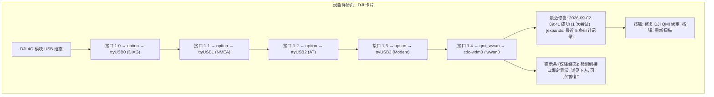
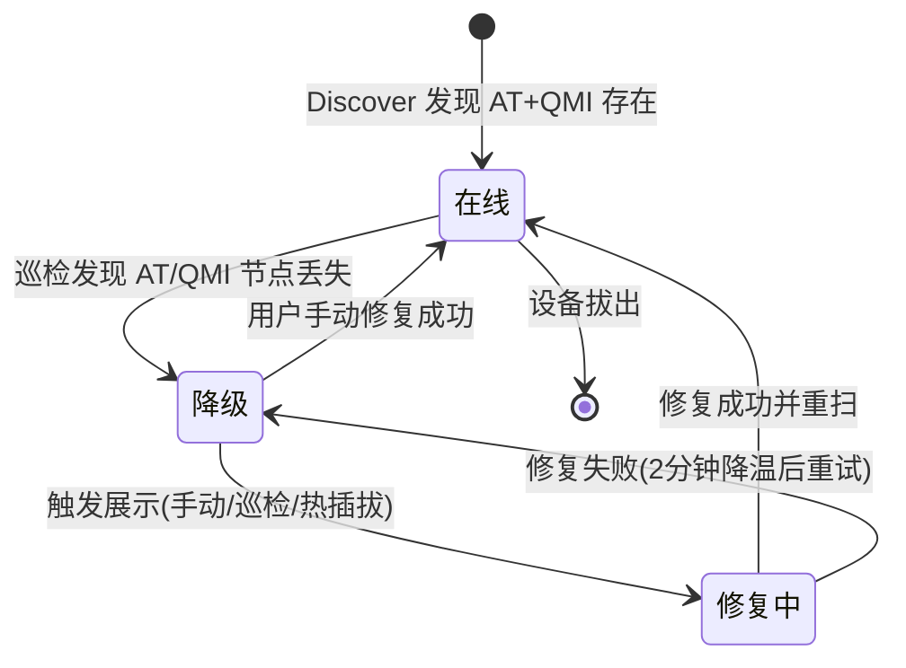

# 大疆 4G 模块（一代）功能增强 PRD

创建日期：2026-09-02
适用版本：VoCat（MengMengCode/VoCat 分支）

---

## 1. 背景与现状

大疆 4G 模块一代（USB `2ca3:4006`）在社区改造成 USB 上网卡后，最常见的宿主是各类 Linux 路由器与 NAS。模块本体是移远 Quectel EG25-G（高通 MDM9x07 平台）级别的调制解调器，VoCat 只能运行在模块接入的 Linux 主机上，通过 USB 上的 AT 串口与 QMI 控制通道管理它。

上一轮迭代已经交付了模块的基础兼容能力：发现阶段识别 `2ca3:4006` 并标记设备类型 `dji_4g`；发现时若检测到 AT/QMI 绑定丢失（冷启动或重连后常见），自动把 0-3 号接口绑定回 `option`、4 号接口绑定回 `qmi_wwan` 并 DTR 唤醒 QMI；添加设备对话框提供"修复 DJI QMI 绑定"按钮按需重跑；`vocat doctor --repair-dji-qmi` 保留 CLI 入口。修复全程不写 NV、不改 USB 身份。

现状仍有几处明显短板，来自社区实测与代码审查：

- 自动修复只在 `Discover()` 被调用时发生（开机、手动扫描、打开添加对话框）。模块在运行期间掉绑定（例如 USBIP 重连）时，已配置设备会变成"死设备"，直到用户手动触发扫描。
- 修复逻辑要求总线上的 DJI 设备恰好一台，插两个模块时自动修复直接跳过低级单台修复。
- 没有主动的 USB 热插拔监听，全部依赖轮询触发。
- 设备详情页看不到接口绑定拓扑，排障只能靠 SSH 翻 sysfs。
- 模块描述符若上报 "Android/Android"，发现列表显示为 "Android"，与任务栏的"大疆 4G 模块（移远芯片）"不一致。

以上判断来自本仓库代码与社区教程（Dji-cellular-modem-auto-load、zkl2333 博客的 VoHive/飞牛实测）`[Research-backed]`。

## 2. 目标与验收标准

目标：让大疆 4G 模块在 VoCat 上达到"插上即可用、掉线自愈、排障有据"的体验，把目前依赖命令行和手动扫描的操作全部收进产品内。

验收标准（可量化）：

| 编号 | 标准 | 衡量方式 |
| --- | --- | --- |
| AC1 | 冷启动插入模块后，打开"添加设备"对话框，DHJI 设备行显示健康状态（有 AT + QMI），无需任何手动命令 | 手动测试 5 次冷启动 |
| AC2 | 运行中掉绑定（模拟 USBIP 重连）的已配置设备，在 ≤ 2 分钟（含 60s 巡检间隔 + 修复耗时）内自愈并恢复操作 | 脚本模拟重连后观察设备页 |
| AC3 | 健康卡片展示的接口拓扑与 sysfs 实际绑定一致（0-3→option/ttyUSB0-3，4→qmi_wwan/cdc-wdm0） | 对照 `ls /sys/bus/usb/drivers/` |
| AC4 | 同时插两个 DJI 模块，两个都能被识别、修复并添加到 VoCat | 手动测试 |
| AC5 | 修复失败时界面给出具体原因（缺 qmicli / 非 root / 接口异常），而不是笼统报错 | UI 文案检查 |

## 3. 用户与典型场景

| 画像 | 熟练度 | 频率 | 诉求 |
| --- | --- | --- | --- |
| 持有一代大疆 4G 模块的路由器玩家 | 中（会刷机、会用 OpenWrt） | 偶尔 | 插卡收短信、上网，冷启动不折腾 |
| NAS 用户（飞牛/Synology 等跑 Docker） | 中 | 偶尔 | 模块接 USB，Docker 起 VoCat，收 SMS 转发告警 |
| VoCat 维护者/贡献者 | 高 | 持续 | 接口拓扑可视化，便于给新人排障 |

核心场景按优先级排序：

1. 冷启动 / 首次插入 → 打开 VoCat → 模块显示健康 → 一键添加。
2. 运行中模块掉绑定 → 后台巡检自动修复 → 设备页恢复正常，无感知。
3. 添加后模块显示为 "Android" → 界面一律显示"大疆 4G 模块"。
4. 排障：设备页查看 5 段 USB 拓扑与最近修复记录。

## 4. 功能需求总览

| # | 模块 | 功能描述 |
| --- | --- | --- |
| F1 | DJI USB 组态健康卡片 | 设备详情页显示模块的 5 段 USB 拓扑（接口号 → 驱动 → 设备节点）、当前绑定时长，内嵌"修复 DJI QMI 绑定"与"重新扫描"入口，展示最近一次修复结果与时间。 |
| F2 | 已配置设备周期健康巡检 | 对 `DeviceType=dji_4g` 且已配置的设备，后台每 60s 校验 AT 与 QMI 节点是否仍存在，**并校验接口归属（0-3=option、4=qmi_wwan）**——`option` 抢先接管 MI_04 时节点尚未消失但接口已被抢走，归属校验可更早发现漂移；任一异常触发一次带降温的重新发现，落入现有自动修复流程。 |
| F3 | DJI 身份归一化 | 发现阶段对 `2ca3:4006` 且描述符为 "Android"/空 的设备，将制造商/产品名归一化为 "DJI 4G Module (Quectel)" 的中文显示。 |
| F4 | 多 DJI 模块支持 | 修复按 USB 路径定位单台设备；自动修复去掉"总线上恰一台"限制，改为逐台判定降级、逐台修复、逐台降温。 |
| F5 | USB 热插拔事件监听 | 监听内核 uevent（`ACTION=add/remove/change` + `2ca3:4006`），精确解析 `PRODUCT=`/`ID_*` 字段防误触发，500ms 去抖窗口把重枚举风暴合并为一次扫描；触发后台重新发现；无 uevent 权限或非 Linux 时静默回退到现有轮询。 |
| F6 | 拨号引导 | 已配设备 QMI 数据连接为断开且网络接口 DOWN 时，在设备页显示"需配置 APN 并开启数据网络"的引导条，带跳转 APN 设置入口。 |
| F7 | 修复审计记录 | 每次自动/手动修复写入已有的设备事件表，健康卡片展示最近 5 条（时间、结果、接口、AT/QMI 节点）。 |
| F8 | 链路质量诊断 | 对启用数据链路的 DJI 设备提供一键延迟探测（复用现有 SOCKS/UDP 探测路径），展示结果与历史。 |
| F9 | 接入部署文档 | 编写"模块接线 → 安装 VoCat → 自动修复 → 添加设备 → SMS/拨号"的完整指南，含每步验证命令。 |
| F10 | DJI 能力矩阵 | 按设备类型展示功能支持矩阵（SMS / 数据 / 飞行模式 / VoWiFi / eSIM），标注 DJI 模块不支持 eSIM、SMS 可独立于数据工作等事实。 |
| F11 | 基带就绪容错 | 修复后 DMS 就绪探测对 `endpoint hangup` / QMI 事务超时等"基带还没醒"的暂时性失败自动重试（QDC507 软重启后有约 10-50s 就绪空窗），不误报修复失败。 |
| F12 | ModemManager 隔离 | 安装脚本自动写入 udev 规则（`ID_MM_DEVICE_IGNORE=1`），让 ModemManager 忽略 2ca3:4006，避免竞争 AT/QMI 控制口。 |

## 5. 模块详述

### 5.1 F1 与 F7：DJI USB 组态健康卡片

**原型**

**业务逻辑**：卡片数据来自一次只读 sysfs 扫描（`internal/device` 新增 `InspectDJIUSBTopology(sysRoot)`），返回每段接口的绑定驱动与设备节点。只有 `DeviceType=dji_4g` 且当前物理存在时展示。

**交互逻辑**：点击"修复 DJI QMI 绑定"→ 调用现有 `POST /api/devices/actions/repair-dji-qmi` → 按钮进入 loading → 完成后刷新卡片与审计记录；失败时红色文案展示 `ErrDJIRepairNotRoot` / `ErrDJIRepairUnsupported` / 具体 sysfs 错误。

**规则约束**：卡片只读，不做任何写入操作；修复按钮在非 root 时禁用并提示原因；审计记录沿用 `internal/store/events` 既有表结构，新增事件类型 `dji_qmi_repair`。

**边界与异常**：模块拔出时卡片隐藏；扫描 sysfs 报错（无权限）时显示"无法读取 USB 拓扑，请以 root 运行"；qmicli 不存在时修复按钮点击后提示安装 libqmi-utils。

### 5.2 F2 与 F5：自愈链路

**原型（状态机）**

**业务逻辑**：

- F2 巡检：后台协程每 60s 遍历已配置 `dji_4g` 设备，对每台先检查接口归属（0-3=`option`、4=`qmi_wwan`，读 sysfs `driver` 符号链接），再检查其配置的 AT 端口与 QMI 控制节点在 `/dev` 下是否仍存在；任一异常 → 调用一次 `Manager.Discover()`（带独立降温，避免与修复自身耦合）。归属校验能捕捉到节点尚未消失、但 `option` 已抢先接管 MI_04 的漂移窗口。
- F5 热插拔：Linux 上新增 netlink `uevent` 监听（`netlink.KernelSubscribe(Uevent)`），**精确匹配** `PRODUCT=2ca3/4006/…`（或成对的 `ID_VENDOR_ID=2CA3`+`ID_MODEL_ID=4006`），避免其他设备描述符中出现的 "2ca3"/"4006" 子串误触发；匹配事件进入 **500ms 去抖窗口**，重枚举风暴（add/remove/change 连续到达）合并为一次 `Discover`；非 Linux 或无权限时仅打日志，依赖现有调用路径。

**规则约束**：F2 巡检与 F5 监听都只触发"重新发现"，真正的驱动重绑仍由现有 `autoRepairDJIQMI` 决定，降温（2 分钟）与"仅单台降级才修复之外的逐台修复"规则在 F4 中统一。巡检间隔与降温时长做成包级常量，便于测试缩短。

**边界与异常**：巡检期间设备拔出/重插，以重扫结果为准；uevent 监听断线（通道溢出）时重建订阅并告警；所有自愈动作不写 NV。

### 5.3 F3：身份归一化

在 `internal/modem/discovery.go` 的 `normalizeUSBIdentity` 中扩展：当 `vendor==2ca3 && product==4006` 且描述符为 "Android"/空时，制造商显示 "DJI"，产品显示 "DJI 4G Module (Quectel)"。前端无需改动，`driver_name` 直接使用归一化结果。规则与现有 `2c7c:0125` 分支并列，互不影响。

### 5.4 F4：多模块支持

当前 `repairDJIQMIAt` 和 `autoRepairDJIQMI` 都要求总线上恰好一台 DJI 设备。改造为按 `USBPath` 定位目标设备：新增 `RepairDJIQMIFor(ctx, usbPath)`，在 sysfs 中只处理该设备路径下的 5 个接口；`autoRepairDJIQMI` 改为对每个降级设备独立判定与修复，降温表沿用现有 `djiRepairAttempt`（以 USBPath 为键，当前实现已满足）。

**边界**：两台设备同时降级时逐台串行处理，避免两个修复进程同时操作 sysfs；同一路径在修复中再次触发时直接跳过。

### 5.5 F6：拨号引导

现有设备页已有网络状态区。新增逻辑：当 `NetworkEnabled==true` 但近期快照显示 `wwanX` 为 DOWN 且 WDS 未连接时，在状态区渲染引导条："该模块需要正确的 APN 与开启数据网络才能拨号，SMS 不依赖数据连接"，提供"前往网络设置"按钮（指向现有卡片 APN/IPCC 设置页）。数据来源全部来自现有快照字段，不新增探测。

### 5.6 F8：链路质量诊断

复用 `internal/proxy`/`internal/exportproxy` 已有的 TCP/UDP 探测能力，在设备页加一个"延迟诊断"入口：执行 3 次 ICMP/TCP 探测，展示 min/avg/max 与丢包，并在卡片下方保留最近 10 条。该功能对以"无人机双链路冗余"为主诉求的用户最有价值，放 P2。

### 5.7 F9/F10：文档与能力矩阵

F9 是一份 Markdown 部署指南（中文优先），覆盖：模块接线（USB 到宿主）、首次安装、自动修复验证、添加设备、SMS 转发配置、拨号 APN。F10 在设备详情的"功能能力"区块用只读表格展示 DeviceType 支持矩阵，内容来自代码中的能力分支（如 `supportsSMS`、VoWiFi 适配器选择），不新增逻辑。

## 6. 分期计划

| 阶段 | 内容 | 依赖 |
| --- | --- | --- |
| 第一期（自愈闭环） | F2 巡检、F4 多模块、F3 归一化 | 现有自动修复（已交付） |
| 第二期（可视排障） | F1 健康卡片、F7 审计记录 | F4（卡片展示逐台拓扑） |
| 第三期（体验增强） | F5 热插拔、F6 拨号引导、F9 文档 | 第一期 |
| 第四期（可选） | F8 质量诊断、F10 能力矩阵 | 无强依赖 |

## 7. 风险与红线

| 风险 | 影响 | 缓解 |
| --- | --- | --- |
| 修复与 ModemManager/其他 QMI 客户端并发竞争 | 接口绑定被抢、AT/QMI 端口抖动 | 修复前检查宿主是否运行 MM 并告警；操作全部走 sysfs，失败即回滚原有绑定 |
| 巡检/监听在低端路由器上占用资源 | CPU/IO 上升 | 巡检间隔 60s、监听仅内存过滤，两项均为轻量操作；作为可配置开关 |
| 多模块同时降级时 sysfs 竞争 | 修复互相干扰 | F4 按路径串行修复 + 每路径独立降温 |
| 监听权限不足 | 功能失效但无感 | uevent 无权限时静默降级到轮询，日志记录一次 |

红线：所有自愈与修复操作绝不写 NV 内存、绝不执行 `AT+QCFG="usbcfg"`/`usbnet` 改写；两处已存在的 `usbnet` 读写能力属于用户显式操作，健康卡片与自愈链路不得调用。

## 8. 实施状态（2026-09-02 已落地）

本 PRD 的全部功能已在当前分支实现并通过全量测试（`go test ./...`、前端 `tsc + vite build`、darwin/arm 交叉编译）：

| 功能 | 状态 | 关键位置 |
| --- | --- | --- |
| F1 健康卡片 | 已实现 | `internal/device/dji_topology_linux.go` + `GET /api/devices/{id}/dji-topology` + `DjiHealthCard.tsx` |
| F2 周期巡检 | 已实现 | `cmd/vocat/dji_health.go`（60s 巡检已配置设备的 /dev 节点 + 接口归属校验 `djiTopologyMisbound`） |
| F3 身份归一化 | 已实现 | `internal/modem/discovery.go` normalizeUSBIdentity 扩展 |
| F4 多模块 | 已实现 | `RepairDJIQMIFor(usbPath)` 逐台修复 + 逐台降温 |
| F5 热插拔监听 | 已实现 | `internal/device/uevent_linux.go`（非 Linux 静默回退轮询） |
| F6 拨号引导 | 已实现 | `DjiHealthCard.tsx` 网络未连接时显示引导条 |
| F7 审计记录 | 已实现 | 自动/手动修复写 `audit_events`（action=dji_qmi_repair），健康卡片展示最近 5 条 |
| F8 链路诊断 | 已实现 | `internal/server/latency_api.go` + `POST /api/devices/{id}/latency-test` |
| F9 部署文档 | 已实现 | `docs/DJI_4G_DEPLOY.md` |
| F10 能力矩阵 | 已实现 | `DjiHealthCard.tsx` 功能能力标签组 |
| F11 基带就绪容错 | 已实现 | `internal/device/dji_linux.go` probeDJIQMIReady 对暂时性失败重试 |
| F12 ModemManager 隔离 | 已实现 | `scripts/install.sh` 写入 `/etc/udev/rules.d/90-vocat-dji-modem.rules` |